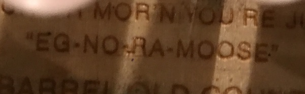

egnoramoose
===========

a cracker barrel boredom simulator that supports arbitrary sizes

instructions
------------

build with `make`

run with `./egnoramoose [size] [row] [col]`

size is the initial size of the board (default 5)

row and col are the initial coordinates of the blank peg (default 0 0)

press j to enter jump coordinates and jump direction

press n to make a new board

press q to quit

have a fun
